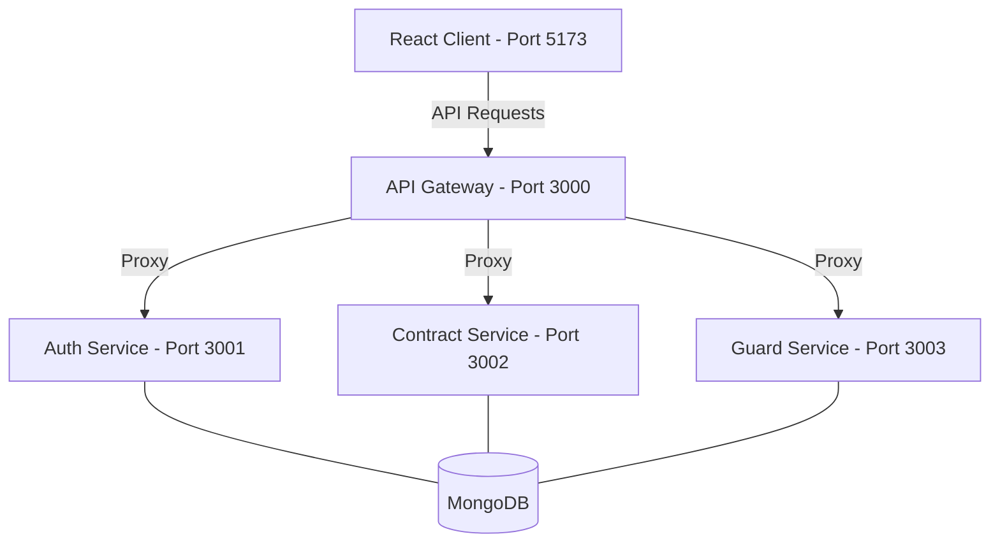

# 🛡️ Contract Guard - Premium Management System

Contract Guard is a high-performance, **Full-Stack MERN** application designed for the professional management of security contracts, guard schedules, and incident tracking. Built on a modern **Microservices Architecture**, it provides a scalable, secure, and intuitive platform for security agencies and facility managers.

---

## ✨ Key Features

- 🔐 **Secure Authentication** - JWT-based authentication system with secure login, registration, and role-based access.
- 📋 **Contract Management** - Comprehensive CRUD operations for contracts, including status tracking, type categorization, and advanced filtering.
- 👮 **Guard Management** - Detailed profiles for security personnel, tracking positions, status, and specializations.
- 📅 **Work Scheduling** - Integrated scheduling system to assign shifts and manage guard availability.
- 📊 **Incident Tracking** - Real-time reporting and management of security incidents with categorical analysis.
- 📈 **Dynamic Dashboard** - Live metrics showing active contracts, total value, and system compliance.
- 🚀 **Microservices Architecture** - Highly scalable system architecture with independent services and a unified API Gateway.
- 🎨 **Modern Responsive UI** - 100% Tailwind CSS-powered interface, fully optimized for both desktop and mobile devices.

---

## 🏗️ Architecture

Contract Guard utilizes a modern monorepo structure with independent services coordinated through an API Gateway.



---

## 🛠️ Technology Stack

| Layer | Technologies |
| :--- | :--- |
| **Frontend** | React 18, Vite, React Router, Tailwind CSS, Axios, Context API |
| **Backend** | Node.js, Express.js, MongoDB + Mongoose |
| **Security** | JWT (JSON Web Tokens), bcryptjs, Helmet, CORS |
| **Monorepo** | npm Workspaces, Concurrently |
| **DevOps** | Docker, Environment Variable Management |

---

## 📦 Project Structure

```text
contract-guard/
├── packages/
│   ├── client/              # React + Vite Frontend (Port 5173)
│   │   └── src/
│   │       ├── apps/        # Feature modules (Auth, Contract, Guard, Dashboard)
│   │       ├── components/  # Shared UI components
│   │       └── hooks/       # Custom React hooks (useAuth, useContracts, etc.)
│   ├── api-gateway/         # Unified Entry Point (Port 3000)
│   │   └── src/index.js     # Internal routing and proxying
│   └── services/            # Microservices (Ports 3001-3003)
│       └── src/             # Auth, Contract, and Guard implementations
├── package.json             # Root monorepo configuration
└── .env                     # Environmental configuration
```

---

## 🚀 Getting Started

### Prerequisites

- **Node.js** (v18 or higher)
- **npm** (v9 or higher)
- **MongoDB** (Local instance or Atlas Cloud)

### Installation

1. **Clone the repository:**
   ```bash
   git clone https://github.com/Prakhar8100/Contract-Gaurd.git
   cd Contract-Gaurd
   ```

2. **Install dependencies:**
   ```bash
   npm install
   ```

### Configuration

> ⚠️ **SECURITY WARNING**: Never commit sensitive credentials to version control. Always use `.env` files locally and add `.env` to `.gitignore`.

Create `.env` files in the following locations. Refer to the specific requirements below (use a strong, randomly-generated `JWT_SECRET` for production).

**`packages/services/.env`:**
```env
PORT=3001
NODE_ENV=development
MONGODB_URI=your_mongodb_connection_string
JWT_SECRET=your_secure_jwt_secret_key_here
REDIS_URL=your_redis_connection_string
```

**`packages/api-gateway/.env`:**
```env
PORT=3000
NODE_ENV=development
AUTH_SERVICE_URL=http://localhost:3001
CONTRACT_SERVICE_URL=http://localhost:3002
GUARD_SERVICE_URL=http://localhost:3003
JWT_SECRET=your_secure_jwt_secret
```

**`packages/client/.env`:**
```env
VITE_API_URL=http://localhost:3000/api
```

---

## 🏃 Running the Application

### All-in-One (Recommended)
From the root directory, start all services (Client, Gateway, and Microservices) concurrently:
```bash
npm run dev
```

### Individual Services
You can also run services independently if needed for development or debugging:
```bash
# Frontend
npm run dev:client

# API Gateway
npm run dev:gateway

# Backend Services
npm run dev:services
```

---

## 🌐 API Endpoints

| Service | Port | Endpoint Pattern | Description |
| :--- | :--- | :--- | :--- |
| **Gateway** | 3000 | `/api/*` | Unified proxy to all microservices |
| **Auth** | 3001 | `/api/auth/*` | Login, Register, Refresh, Me |
| **Contract** | 3002 | `/api/contracts/*` | Contract CRUD and summary statistics |
| **Guard** | 3003 | `/api/guards/*` | Guard profiles, schedules, and incidents |

---

## 🛣️ Roadmap

- [ ] PDF Generation for official contracts
- [ ] Real-time notifications via WebSockets
- [ ] Advanced analytical reporting charts
- [ ] Multi-tenant support
- [ ] AI-driven risk assessment for contracts

---


